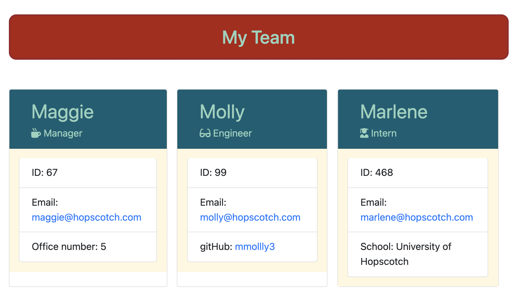

# Team Profiler
   
  
                
   

  ## TABLE OF CONTENTS

  ---

  [Description](#description) *
  [Installation](#installation) *
  [Usage](#usage) *
  [Contributions](#contributions) *
  [Tests](#tests) *
  [Questions](#questions) *
  [License](#license)

   

  
  
   

  ## Description

  ---

  This is a command line application. It generates a HTML file populated with cards listing employee profiles based on user input.

   
  Repo: (https://github.com/sihayah/Team-Profiler)

  

  ## Installation

  ---
  
  Download this repository locally. CD to the root file in your terminal, and run 'npm i'.

   

## Usage

  ---
  Run node index in the command line, and answer all of the questions. Once the inquiry is complete, the HTML file will be written into the dis folder.

  Demo: https://www.youtube.com/watch?v=3T8Xl7VcAOE

   

  ## Tests

  ---

  tbd...

   

  ## Questions

  ---

  For any further inquiries, please contact me via gitHub: [(sihayah)](https://github.com/sihayah) or email: sihaya_a@hotmail.com
